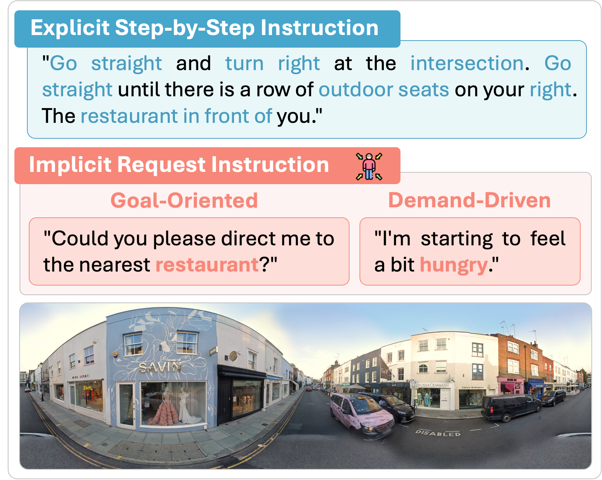
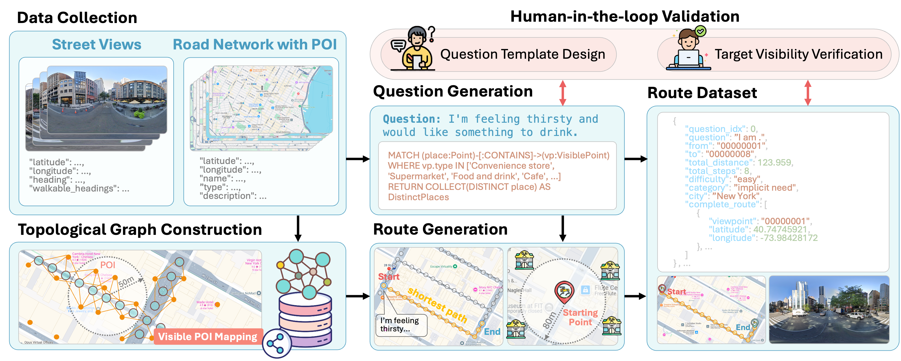
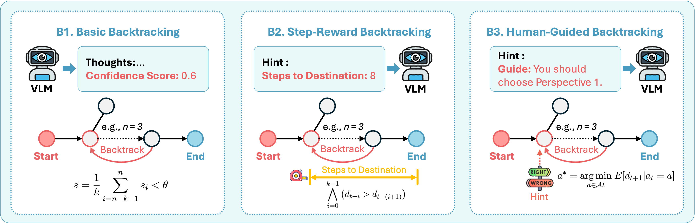
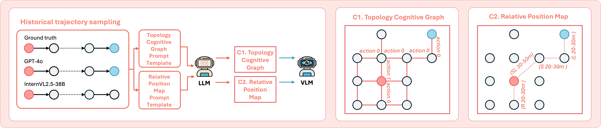
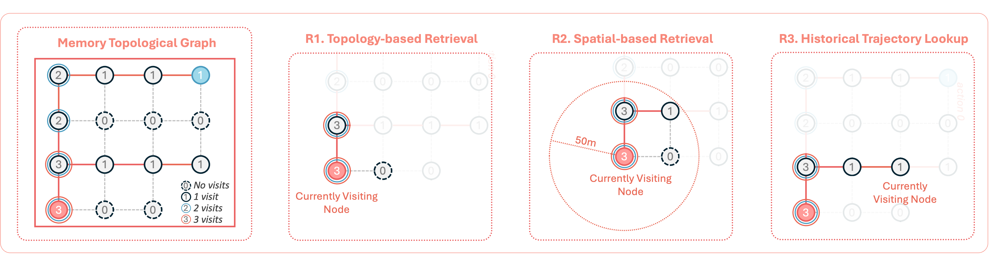

<div align="center">
  <h1>CitySeeker: A VLM Benchmark for Implicit Requests in Embodied Urban Navigation</h1>
  
  
</div>


## ✨ Highlights  
- **CitySeeker pioneers the first language-guided embodied urban navigation** with implicit requests in multi-city settings, incorporating real-world visual diversity, long-horizon planning, and unstructured instructions.  
- **VLM-based cognitive mapping framework** that translates implicit requests into multi-step plans through iterative observation-reasoning cycles.  
- **Extensive exploratory experiments** identifying key bottlenecks in VLMs’ spatial reasoning and providing actionable insights for spatial intelligence.  
<p align="center">

</p>


## 📊 Dataset Overview  

**CitySeeker** is the first benchmark for **implicit request-based navigation** in dynamic urban environments, covering **8 city areas** with **41,128 nodes** and **6,440 instructions**.  

<p align="center">

</p>

| **Dataset**   | **Instruction Type** | **#Instructions** | **Environment**       | **Source**               | **#City** | **#Nodes** | **Avg.Length** | **Avg.Token** |  
|---------------|----------------------|-------------------|-----------------------|--------------------------|-----------|------------|----------------|---------------|  
| Talk the Walk | explicit             | 786               | GridWorld             | 3D Rendering             | 1         | 100        | 6.8            | 34.5          |  
| Room-to-Room  | explicit             | 21,567            | Indoor                | Panoramas                | 1         | 10,800     | 6.0            | 29.0          |  
| Touchdown     | explicit             | 9,326             | Outdoor               | Street View              | 1         | 29,641     | 35.2           | 89.6          |  
| **CitySeeker**| **implicit**         | **6,440**         | **Outdoor+dynamic**   | **Street View + Map**    | **8**     | **41,128** | **18.3**       | **11.11**     |  

---

## 🏆 Benchmark Results  

**Key Metrics**:  
- **TCE (Task Completion Error)**, **TCP (Task Completion Precision)**, **TCC (Task Completion Consistency)**  
- **SPD (Shortest Path Distance)**, **nDTW (Normalized Dynamic Time Warping)**  

| **Model**          | **TCE**  | **TCP**  | **TCC**  | **SPD**  | **nDTW** |  
|--------------------|----------|----------|----------|----------|----------|  
| **GPT-4o**         | 2.39%    | 18.30%   | 6.84%    | 125.40   | 136.97   |  
| **Gemini-1.5-pro** | 1.91%    | 15.43%   | 7.48%    | 157.14   | 241.86   |  
| **InternVL2.5-38B**| 2.23%    | 18.14%   | 7.16%    | 136.55   | 169.18   |  

*(Full results in paper)*  

---

## 🔍 Key Innovations  

### 🔄 **Backtracking Mechanisms**  
Three strategies to mitigate error accumulation in long trajectories:  
1. **Basic Backtracking (B1)**: In this basic backtracking strategy, the agent reverts to the last "trusted" node when its internal confidence falls below a predefined threshold.  
2. **Step-Reward Backtracking (B2)**: This mechanism evaluates progress toward the goal by replacing subjective confidence scores with objective topological distance as the backtracking criterion.  
3. **Human-Guided Backtracking (B3)**: This strategy extends basic backtracking B1 with corrective guidance, providing minimal external "hint" that suggests the best action to take next after backtracking.  
<p align="center">

</p>

### 🗺️ **Enriching Spatial Cognition**  
- **Topology Cognitive Graph (C1)**: In this approach, the VLM is provided with a topological graph of recently traversed segments, which explicitly defines the connectivity between various locations.
- **Relative Position Maps (C2)**: In contrast, this approach emphasizes the spatial orientation of locations without directly specifying connectivity. 
<p align="center">

</p>

### 🧠 **Memory-Based Retrieval**  
1. **Topology-based (R1)**
2. **Spatial-based (R2)**
3. **Historical Trajectory Lookup (R3)**
Each component supports different aspects of memory retrieval across multiple reasoning iterations, mitigating error propagation during navigation tasks.
<p align="center">

</p>

## 📥 Data & Usage  
**Download**: 
The **raw image and topological graph data** is available for download from **[Baidu Netdisk](https://pan.baidu.com/s/1Szh9Duj6SFsapz9PsBPp8g?pwd=ni3n)**


---

## 🌐 License  
This project is open-sourced under **MIT License**.  
*Data for research use only. Commercial use requires permission.*  

--- 

Let me know if you'd like any modifications! The README now aligns with your paper's focus on **implicit urban navigation** and highlights the key innovations clearly.


<div align="center" style="font-family: charter;">
  <h1>Decoding Urban Industrial Complexity:<br>Enhancing Knowledge-Driven Insights via IndustryScopeGPT</h1>


</div>


----

## ✏️ Hightlights

### 🎯 Top Open-Source Urban Knowledge Graph Dataset

IndustryScopeKG is the first and largest open-source, multimodal large-scale knowledge graph dataset. It integrates geospatial data such as street view images, points of interest, and crowd activities, along with socio-economic data including company information, real estate prices, and population statistics. The dataset contains 2,232,037 entities and 51,684,939 triples.
<p align="center">

</p>

### 🎯 First Application of LLM in Industrial Park Planning and Operations

The IndustryScopeGPT framework was developed to enhance the planning, action, and reasoning capabilities of large language models (LLMs) in industrial park planning and operations. This framework represents the first integration of large language models with spatial computing and dynamic reasoning on graph databases that incorporate external geospatial data, marking the first exploration of such applications in industrial park planning and operations.
<p align="center">

</p>


## 🔗 IndustryscopeKG Data

The **raw data** is available for download from **[Kaggle](https://www.kaggle.com/datasets/amoyoukou/industryscopekg)** or **[Baidu Netdisk](https://pan.baidu.com/s/1Szh9Duj6SFsapz9PsBPp8g?pwd=ni3n)**.

- `industryscopekg.dump`

This file contains the standalone Knowledge Graph data, designed for users who want to work directly with the raw data or already have a Neo4j setup and wish to directly import the dataset.

- `industryscopekgdocker.zip`

If you downloaded the file from Kaggle as `industryscopekgdocker.sip`, please rename the file extension from `.sip` to `.zip` and unzip the contents.
If you obtained the file from Baidu Netdisk, it will already be named `industryscopekgdocker.zip`, and no further renaming is required. Simply unzip the contents to proceed.

**After unzipping the `.zip` file, you will get the `industryscopekgneo4j.tar` file**. 

For seamless integration, we recommend using **Neo4j** to analyze and interact with the knowledge graph.

---

### 🛠️ Getting Started with Neo4j

We provide a **Neo4j Docker Image** to simplify the process of setting up and working with the IndustryScopeKG dataset.

### Step 1: Install Docker

Ensure you have Docker installed on your system. For installation instructions, visit [Docker's official website](https://www.docker.com/).

### Step 2: Load the Docker Image
Use the following command to load the `industryscopekgneo4j.tar` into your local Docker environment:

```bash
docker load -i industryscopekgneo4j.tar
```

After the image is loaded, Docker will display the name and tag of the image, typically `neo4jv_backup:latest`.


### Step 3: Start Neo4j with IndustryScopeKG
Run the following command to start a Neo4j container with the dataset preloaded:

```bash
docker run \
  -itd \
  --name industryscope \
  -p 7474:7474 -p 7687:7687 \
  neo4jv_backup:latest
```

**Default credentials**:
- **Username**: `neo4j`
- **Password**: `bitnami1`

**Note**: We use `bitnami/neo4j:5.13.0` as our base image, and we compiled [spatial plugin](https://github.com/neo4j-contrib/spatial.git) manually with maven which already exists in our docker image provided. 

### Step 4: Access Neo4j

1. Open your browser and navigate to: [http://localhost:7474](http://localhost:7474).
2. Login with the credentials  (`neoo4j/bitnami1`).


### 🌰 Example Queries
Here are some useful Cypher queries you can play with:

Question 1: 静安区的所有产业园区都有哪些？  
```
MATCH (p:park) 
WHERE p.所属区县 = "静安区"
RETURN p.名称 AS 园区名称
```
Question 2: 上海张江高科技园内的网格根据零售服务POI数量的排序是什么？ 

```
MATCH (p:park {{名称: "上海张江高科技园区"}})-[:IS_IN]-(f:fishnet)
RETURN p.fishnet AS FishnetID, f.零售服务POI数量 AS RetailServicesCount
ORDER BY RetailServicesCount DESC
```

Question 3: 朕天总部经济工业园里有没有便利店？

```
MATCH (poi:poi_retail)-[:IS_IN]->(:park {{名称: '朕天总部经济工业园'}})
WHERE poi.类别 CONTAINS '便利店' OR poi.类别 CONTAINS '零售' OR poi.类别 CONTAINS '便民商店'
RETURN COUNT(poi) AS 便利店数量
```

Question 4: 张江高新区杨浦园里有几家华润？

```
MATCH (poi)-[:IS_IN]->(:park {{名称: '张江高新区杨浦园'}})
WHERE poi.名称 CONTAINS '华润'
RETURN COUNT(poi) AS 华润数量
```

Question 5: 张江高新区杨浦园里的华润名称是什么？

```
MATCH (poi)-[:IS_IN]->(:park{{名称: '张江高新区杨浦园'}})
WHERE poi.名称 CONTAINS '华润'
RETURN poi.名称 AS 华润名称
```


### 📈 Key Statistics

Table 1: The Statistics of Entities in IndustryScopeKG

| **Basic Statistics**        | **Industrial Park** | **Grid** | **Grid Dominant Function** | **POI**   | **Enterprise** | **Total**   |
|-----------------------------|---------------------|----------|---------------------------|-----------|----------------|-------------|
| **Count**                   | 264                 | 128,866  | 15                        | 112,931   | 1,058,656      | 1,300,732   |
| **(Leading) Industries**    | **Primary**         | **Secondary** | **Tertiary**          | **Scope of Operations** | **Planned** |             |
| **Industrial Park**         | 202                 | 258      | 261                      | 261       | 70             | 1,052       |
| **Grid**                    | 1,142               | 6,270    | 10,281                   | 20,246    | /              | 37,939      |
| **Enterprise**              | 18                  | 90       | 392                      | 891,814   | /              | 892,314     |

---

Table 2: The Statistics of Triples in IndustryScopeKG

| **Relation**    | **Head & Tail Entity**                                                                                                      | **Triple Records** |
|------------------|---------------------------------------------------------------------------------------------------------------------------|--------------------|
| **Locate in**    | (POI, Grid), (Enterprise, Grid), (POI, Industrial Park), (Enterprise, Industrial Park), (Grid, Industrial Park)           | 2,516,160          |
| **Adjacent to**  | (Grid, Grid), (Industrial Park, Industrial Park)                                                                          | 488,401            |
| **Similar to**   | (Industrial Park, Industrial Park)                                                                                       | 3,765              |
| **Related to**   | (Industrial Park, Industrial Park)                                                                                       | 10,687             |
| **Has**          | E.g., (Industrial Park, Planned Industries), (Grid, Leading Scope of Operations), (Grid, Dominant Functions)             | 4,252,341          |
| **Attribution**  | (Industrial Park, Value) with 111 attributions, (Grid, Value) with 82 attributions, (POI, Value) including 15 attributions, (Enterprise, Value) with 36 attributions | 44,413,585         |

### 🌟 Usage Notes
The dataset can be used standalone or integrated into your projects. It works particularly well with graph-based reasoning frameworks.
For LLM-based planning and operations, the dataset complements the IndustryScopeGPT framework, providing a dynamic and insightful environment for urban and industrial research.


